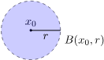

# Հաջորդականություն R^m-ում
- [Հաջորդականություն R^m-ում](#հաջորդականություն-rm-ում)
    - [Հիմնական սահմանումներ](#հիմնական-սահմանումներ)
    - [Հեռավորություն և Գնդեր](#հեռավորություն-և-գնդեր)
    - [Սահմանափակություն և Սահման](#սահմանափակություն-և-սահման)
    - [Կոորդինատային զուգամիտության սկզբունքը](#կոորդինատային-զուգամիտության-սկզբունքը)
    - [Բոլցանո-Վայերշտրասի լեմման R^m-ում](#բոլցանո-վայերշտրասի-լեմման-rm-ում)
    - [Կոշու զուգամիտության սկզբունքը](#կոշու-զուգամիտության-սկզբունքը)
    - [Կուտակման կետեր](#կուտակման-կետեր)


### Հիմնական սահմանումներ

Արդեն գիտենք, որ եթե $x, y \in \mathbb{R}^m$ տարրերի համար, որտեղ $x=(x^1, x^2, \dots, x^m)$, $y=(y^1, y^2, \dots, y^m)$, գումարումը սահմանենք՝

```math
x+y = (x^1+y^1, x^2+y^2, \dots, x^m+y^m)
```

իսկ սկալյարով բազմապատկումը՝

```math
\lambda x = (\lambda x^1, \lambda x^2, \dots, \lambda x^m)
```

օրենքներով, ապա $\mathbb{R}^m$-ը այս գործողությունների հետ կդառնա գծային տարածություն։ Ավելին, այն նորմավորված է, քանի որ հեշտ է ստուգել, որ $\|x\| = \sqrt{(x^1)^2 + \dots + (x^m)^2}$ բանաձևը բավարարում է նորմի պայմաններին։

**Սահմանում 1:** $\mathbb{R}^m$-ում ***հաջորդականություն*** ասելով կհասկանանք հետևյալ բազմությունը՝ $\{x_n\}_{n=1}^\infty$, որտեղ $x_n \in \mathbb{R}^m$ ($n \in \mathbb{N}$):

$\{x_n\}_{n=1}^\infty \subset \mathbb{R}^m$

### Հեռավորություն և Գնդեր

**Սահմանում 2**: $x, y \in \mathbb{R}^m$ տարրերի ***հեռավորություն*** ասելով կհասկանանք $x-y$-ի նորմը։ Այսինքն՝

```math
d(x, y) = \|x - y\|
```
(x-y)-ը $\mathbb{R}^m$֊ի տարր է => ունի նորմ ու հենց էդ նորմն էլ կանվանենք $x, y \in \mathbb{R}^m$ տարրերի *հեռավորություն*։ 

**Սահմանում 3:** $\mathbb{R}^m$-ում $a$ կենտրոնով և $r$ շառավղով ***բաց գունդ*** ասելով կհասկանանք հետևյալ բազմությունը՝

```math
B(a, r) = \{x \in \mathbb{R}^m \mid d(a, x) < r\} = \{x \in \mathbb{R}^m \mid \|x - a\| < r\}
```


**Սահմանում 4**: $\mathbb{R}^m$-ում $a$ կենտրոնով և $r$ շառավղով **փակ գունդ** ասելով կհասկանանք հետևյալ բազմությունը՝

```math
\bar{B}(a, r) = \{x \in \mathbb{R}^m \mid d(a, x) \le r\} = \{x \in \mathbb{R}^m \mid \|x - a\| \le r\}
```

**Մասնավորապես:**

- $m=1$ դեպքում՝ $(a-r, a+r)$ միջակայքն է։
    
- $m=2$ դեպքում՝ շրջան (բաց կամ փակ)։
    

---

### Սահմանափակություն և Սահման

**Սահմանում 5:** Կասենք, որ $\{x_n\}_{n=1}^\infty$ հաջորդականությունը **սահմանափակ է** $\mathbb{R}^m$-ում, եթե $\exists M$ s.t. $\|x_n\| \le M$:

**Սահմանում 6:** Կասենք, որ $x_n \in \mathbb{R}^m$, $x_n \to \infty$, եթե $\forall E$-ի համար $\exists n_0 \in \mathbb{N}$ s.t. $n > n_0 \implies \|x_n\| > E$:

**Սահմանում 7 (Հաջորդականության սահման):** $a \in \mathbb{R}^m$ տարրը կոչվում է $x_n \in \mathbb{R}^m$ հաջորդականության սահման, եթե $\forall \varepsilon > 0$-ի համար $\exists n_0(\varepsilon) \in \mathbb{N}$ s.t. $n > n_0(\varepsilon) \implies \|x_n - a\| < \varepsilon$: (հեռավորությունը պիտի ձգտի զրոյի)

---

### Կոորդինատային զուգամիտության սկզբունքը

Նորմի սահմանումից բխում են

```math
|x^i| \le \|x\| \le |x^1| + |x^2| + \dots + |x^m| \quad (1)
```

Իրոք, $|x^i| = \sqrt{(x^i)^2} \le \sqrt{(x^1)^2 + \dots + (x^m)^2} = ||x|| \le \sqrt{(|x^1| + \dots + |x^m|)^2} = \dots$
```math
\left(|x^1| + \dots + |x^m|\right)^2 = \underbrace{\sum_{i=1}^m |x^i|^2}_{\|x\|^2} + \underbrace{2 \sum_{1 \le j < k \le m} |x^j||x^k|}_{\ge 0}
```

Քանի որ «խառը արտադրյալները» ($2|x^j||x^k|$) ոչ բացասական են, ապա՝

```math
\left(\sum |x^i|\right)^2 \ge \sum |x^i|^2 = \|x\|^2
```

Արմատ հանելով՝ կստանանք պահանջվող անհավասարությունը՝

```math
|x^1| + \dots + |x^m| \ge \|x\|
```

**Թեորեմ (Կոորդինատային զուգամիտության թեորեմը)**։ Դիցուք $a = (a^1, \dots, a^m) \in R^m$: Որպեսզի $x_n \to a$, անհրաժեշտ է և բավարար, որ

$$\left. \begin{aligned} x_n^1 &\to a^1 \\ x_n^2 &\to a^2 \\ \cdot \ &\cdot \ \cdot \\ x_n^m &\to a^m \end{aligned} \right\} : \tag{1.3}$$

**Ապացույց:**


$(\Rightarrow)$ Դիցուք $x_n \overset{n \to \infty}{\longrightarrow} a$: Հետևաբար $\forall \varepsilon > 0$-ի համար $\exists n_0(\varepsilon) \in \mathbb{N}$ s.t. $n > n_0(\varepsilon) \implies \|x_n - a\| < \varepsilon$:

Օգտվելով (1)-ից կարող ենք ասել, որ $|x_n^i - a^i| < \|x_n - a\| < \varepsilon$:

$\implies \forall i, \forall \varepsilon > 0, \exists n_0(\varepsilon) \in \mathbb{N}$ s.t. $n > n_0(\varepsilon) \implies |x_n^i - a^i| < \varepsilon$ ($i = \overline{1, m}$): Ուստի $x_n^i \overset{n \to \infty}{\longrightarrow} a^i$:

$(\Leftarrow)$ Դիցուք $x_n^i \overset{n \to \infty}{\longrightarrow} a^i$ ($i = \overline{1, m}$): Ցույց տանք, որ $x_n \overset{n \to \infty}{\longrightarrow} a$:

Օգտվելով $\|x_n - a\| \le |x_n^1 - a^1| + |x_n^2 - a^2| + \dots + |x_n^m - a^m|$ անհավասարությունից և $x_n^i \to a^i$ ($i=\overline{1, m}$)-ից կունենանք, որ $\forall \varepsilon > 0$-ի համար $\|x_n - a\| < m \varepsilon_1$:

Նշանակենք $\varepsilon_1 = \frac{\varepsilon}{m}$, կունենանք որ $\|x_n - a\| < \varepsilon$:


---

### Բոլցանո-Վայերշտրասի լեմման R^m-ում

**Թեորեմ (Բոլցանո-Վայերշտրաս):** $\mathbb{R}^m$-ի սահմանափակ հաջորդականությունից կարելի է առանձնացնել զուգամետ ենթահաջորդականություն։

**Ապացույց։**

Նախ ապացուցենք $m=2$ դեպքում։ Ունենք $x_n = (x_n^1, x_n^2)$ սահմանափակ հաջորդականությունը՝ $|x_n| \leq L, n \in N$: (1)-ի համաձայն ունենք՝

$$|x_n^1| \leq L, \quad |x_n^2| \leq L :$$

Թվային հաջորդականությունների վերաբերյալ Բոլցանո-Վայերշտրասի լեմմայի համաձայն, $x_n^1$ հաջորդականությունը պարունակում է զուգամետ ենթահաջորդականություն՝

$$x_{n_k}^1 \to x_0^1 \tag{1.5}$$

Այժմ, $x_{n_k}^2$ հաջորդականության համար կիրառելով Բոլցանո-Վայերշտրասի լեմման, կստանանք՝

$$x_{n_{k_l}}^2 \to x_0^2, \quad l \to \infty \tag{1.6}$$

Նախորդ թեորեմի համաձայն, (1.5)-ից և (1.6)-ից հետևում է՝

$$x_{n_{k_l}} \to (x_0^1, x_0^2), \quad l \to \infty :$$

Քանի որ $x_{n_{k_l}}$-ը $x_n$ հաջորդականության ենթահաջորդականություն է, ապա $m=2$ դեպքում ապացույցն ավարտված է։

Ընդհանուր դեպքում պնդումն ապացուցելու համար կկիրառենք մաթեմատիկական ինդուկցիա ըստ $m$-ի։ ■

---

### Կոշու զուգամիտության սկզբունքը

**Սահմանում 8:** $\{x_n\}_{n=1}^\infty \subset \mathbb{R}^m$ հաջորդականությունը կոչվում է **ֆունդամենտալ**, եթե $\forall \varepsilon > 0$-ի համար $\exists n_0 \in \mathbb{N}$ s.t. $n > n_0(\varepsilon) \implies \|x_n - x_m\| < \varepsilon$ (երբ $m > n_0$):

**Թեորեմ:** Որպեսզի $x_n \in \mathbb{R}^m$ հաջորդականությունը լինի զուգամետ $\iff$ այն լինի ֆունդամենտալ։

**Ապացույց:**

$(\Rightarrow)$ Դիցուք $x_n$-ը զուգամետ է, այսինքն $\exists a \in \mathbb{R}^m$ s.t. $\forall \varepsilon > 0$ $\exists n_0(\varepsilon) \in \mathbb{N}$ $m, n > n_0(\varepsilon) \implies$

$\begin{cases} \|x_n - a\| < \frac{\varepsilon}{2} \\ \|x_m - a\| < \frac{\varepsilon}{2} \end{cases}$

Դիտարկենք հետևյալը՝

$\|x_n - x_m\| = \|x_n - a + a - x_m\| \le \|x_n - a\| + \|x_m - a\| < \frac{\varepsilon}{2} + \frac{\varepsilon}{2} = \varepsilon$:

$(\Leftarrow)$ Դիցուք $\forall \varepsilon > 0$-ի համար $\exists n_0(\varepsilon) \in \mathbb{N}$ s.t. $n, m > n_0 \implies \|x_n - x_m\| < \varepsilon$:

Օգտվելով (1)-ից՝ կունենանք՝

$|x_n^i - x_m^i| \le \|x_n - x_m\| < \varepsilon \implies \forall \varepsilon > 0$-ի համար $\exists n_0(\varepsilon)$ s.t. $m, n > n_0(\varepsilon) \implies |x_n^i - x_m^i| < \varepsilon$ ($i = \overline{1, m}$):

Ինչը նշանակում է, որ $x_n^i$ թվային հաջորդականությունը ֆունդամենտալ է: Հետևաբար, ըստ Կոշու զուգամիտության սկզբունքի, թվային հաջորդականությունների համար $\exists a^i \in \mathbb{R}$ s.t. $x_n^i \overset{n \to \infty}{\longrightarrow} a^i$ ($i = \overline{1, m}$):

Օգտվելով կոորդինատային զուգամիտության սկզբունքից, կարելի է պնդել, որ $x_n \overset{n \to \infty}{\longrightarrow} a$, որտեղ $a=(a^1, a^2, \dots, a^m)$:

---

### Կուտակման կետեր

**Սահմանում 9:** Դիցուք $E \subseteq \mathbb{R}^m$։ $x_0 \in \mathbb{R}^m$ կետը կոչվում է $E$ բազմության **կուտակման կետ**, եթե $x_0$-ի ցանկացած $B(a, \varepsilon)$ շրջակայքում $E$-ի անվերջ թվով կետեր կան առկա։ 

$E$ բազմության կուտակման կետերի բազմությունը նշանակենք $E'$-ով:
