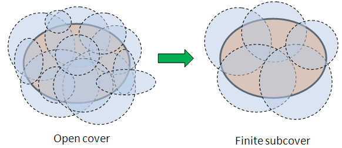

# Ֆունկցիայի անընդհատություն
- [Ֆունկցիայի անընդհատություն](#ֆունկցիայի-անընդհատություն)
    - [Վեկտոր արժեք ֆունկցիաներ](#վեկտոր-արժեք-ֆունկցիաներ)
    - [Բոլցանո-Կոշիի թեորեմները շատ փոփոխականի համար](#բոլցանո-կոշիի-թեորեմները-շատ-փոփոխականի-համար)
    - [Վեյերշտրասի թեորեմները շատ փոփոխականի ֆունկցիաների համար](#վեյերշտրասի-թեորեմները-շատ-փոփոխականի-ֆունկցիաների-համար)
    - [Կանտորի թեորեմ](#կանտորի-թեորեմ)

**Սահմանում 1:** Բաց կապակցված բազմությունը կոչվում է **տիրույթ** կամ **բաց տիրույթ**:

**Սահմանում 2:** Փակ կապակցված բազմությունը կոչվում է **փակ տիրույթ**:

**Սահմանում 3:** $x_0 \in E$ ($E \subset \mathbb{R}^m$) կետը կոչվում է $E$-ի **մեկուսացված կետ**, եթե $\exists \delta > 0$ այնպես, որ $B(x_0, \delta) \cap E = \{x_0\}$:

**Սահմանում 4:** Դիցուք $f: E \to \mathbb{R}$ ($E \subset \mathbb{R}^m$): Կասենք, որ $f$-ը **անընդհատ է** $x_0 \in E$ կետում, եթե $\forall \varepsilon > 0$, $\exists \delta(\varepsilon) > 0$ այնպես, որ $\forall x \in E$, $\|x - x_0\| < \delta \implies |f(x) - f(x_0)| < \varepsilon$:

> Վերջին երկու սահմանումներից $\implies$, որ $\forall$ մեկուսացված կետում ֆունկցիան անընդհատ է:

(4) սահմանումից $\implies$, որ $\lim_{x \to x_0} f(x) = f(x_0)$:

**Թեորեմ:** Որպեսզի $f$ ֆունկցիան $x_0 \in E$ կետում լինի անընդհատ, անհրաժեշտ է և բավարար, որ $\forall \{x_n\} \subset E$, $x_n \to x_0 \implies f(x_n) \to f(x_0)$:

---

**Թեորեմ: (Մասնակի անընդհատության մասին)** Դիցուք ունենք $f: E \to \mathbb{R}$ ($E \subset \mathbb{R}^m$), $x_0 \in E$, $x_0 = (x_0^1, x_0^2, \dots, x_0^{i-1}, x_0^i, x_0^{i+1}, \dots, x_0^m)$: Ունենք նաև, որ $f$-ը $x_0$-ում անընդհատ է:

Այդ դեպքում $\varphi(y)$ մեկ փոփոխականի ֆունկցիան, որը որոշվում է $(x_0^1, x_0^2, \dots, x_0^{i-1}, y, x_0^{i+1}, \dots, x_0^m) \in E$ կետերի համար, անընդհատ է $x_0^i$ կետում:

**Ապացույց:** Երբ մենք փոփոխում ենք միայն $i$-րդ կոորդինատը ($y \to x_0^i$), իսկ մնացածը թողնում ենք անփոփոխ, ստացված $x = (x_0^1, \dots, y, \dots, x_0^m)$ կետը ձգտում է $x_0$-ին $R^m$ տարածության մեջ։

Քանի որ $y \to x_0^i$, ապա կոորդինատային զուգամիտության թեորեմի համաձայն՝

$$x = (x_0^1, \dots, y, \dots, x_0^m) \xrightarrow[R^m]{} (x_0^1, \dots, x_0^i, \dots, x_0^m) = x_0$$

Քանի որ $f$-ը $x_0$ կետում անընդհատ է, ապա ըստ Հայնեի սահմանման՝ եթե արգումենտը ձգտում է կետին ($x \to x_0$), ապա ֆունկցիայի արժեքը ձգտում է այդ կետում ֆունկցիայի արժեքին.

$$f(x) \to f(x_0)$$

Հաշվի առնելով, որ $f(x) = \varphi(y)$ և $f(x_0) = \varphi(x_0^i)$, ստանում ենք.

$$\lim_{y \to x_0^i} \varphi(y) = \varphi(x_0^i)$$

Ինչը նշանակում է, որ $\varphi(y)$-ը անընդհատ է $x_0^i$ կետում։ $\blacksquare$

---

### Վեկտոր արժեք ֆունկցիաներ

**Սահմանում:** $f: E \to \mathbb{R}^k$ ($E \subset \mathbb{R}^m, k \ge 2$) արտապատկերումը կոչվում է **վեկտոր-արժեք ֆունկցիա**:

$\forall x_0 \in \mathbb{R}^m \to f(x) = (f^1(x_0), f^2(x_0), \dots, f^k(x_0)) \in \mathbb{R}^k$:

**Սահմանում:** $f^1(x), \dots, f^k(x)$ իրական արժեքներ ընդունող ֆունկցիաները կոչվում են $f$-ի **կոորդինատային ֆունկցիաներ**:

**Սահմանում:** $f: E \to \mathbb{R}^k$ ($E \subset \mathbb{R}^m$) վեկտոր-արժեք ֆունկցիան կոչվում է **անընդհատ** $x_0 \in E$ կետում, եթե $\forall \varepsilon > 0$, $\exists \delta(\varepsilon) > 0$ այնպես, որ $\forall x \in E, \|x - x_0\| < \delta \implies \|f(x) - f(x_0)\| < \varepsilon$:

**Թեորեմ:** Որպեսզի $f: E \to \mathbb{R}^k$ ($E \subset \mathbb{R}^m$) ֆունկցիան անընդհատ լինի $x_0 = (x_0^1, \dots, x_0^m) \in E$ կետում, անհրաժեշտ է և բավարար, որ $x \to x_0 \implies$

$f^1(x) \to f^1(x_0)$

$f^2(x) \to f^2(x_0)$

...

$f^k(x) \to f^k(x_0)$

**Ապացույց:** Կոորդինատային զուգամիտությունից :

---

**Թեորեմ:** Եթե $\exists \lim_{x \to x_0} f(x)$ և $\exists \lim_{x \to x_0} g(x)$, որտեղ $f, g: E \to \mathbb{R}$ ($E \subset \mathbb{R}^m$), $x_0 \in E'$, ապա $\exists \lim (f \pm g)$, $\lim (c \cdot f)$, $\lim (f \cdot g)$, և եթե $\lim_{x \to x_0} g \ne 0$, ապա $\lim \frac{f}{g}$:

Ընդ որում՝

1. $\lim_{x \to x_0} (f \pm g) = \lim_{x \to x_0} f \pm \lim_{x \to x_0} g$
    
2. $\lim_{x \to x_0} c f = c \lim_{x \to x_0} f$
    
3. $\lim_{x \to x_0} f \cdot g = \lim_{x \to x_0} f \cdot \lim_{x \to x_0} g$
    
4. $\lim_{x \to x_0} \frac{f}{g} = \frac{\lim f}{\lim g}$, եթե $\lim g \ne 0$
    

**Հետևանք:** Եթե $f, g: E \to \mathbb{R}$ ($E \subset \mathbb{R}^m$) ֆունկցիաները անընդհատ են $x_0 \in E$ կետում, ապա անընդհատ են նաև $f \pm g, c \cdot f, f \cdot g, f/g$: (Եթե $g(x_0) \ne 0$):

---

**Թեորեմ (Բարդ ֆունկցիայի անընդհատություն):**

Դիցուք տրված են $f: E \to K$ և $g: K \to F$ ֆունկցիաները, որտեղ $E \subset \mathbb{R}^n, K \subset \mathbb{R}^m, F \subset \mathbb{R}^k$:

Եթե $f$-ը անընդհատ է $x_0 \in E$ կետում և $g$-ն անընդհատ է $f(x_0) \in K$ կետում, ապա $g \circ f$ բարդ ֆունկցիան անընդհատ է $x_0 \in E$ կետում:

**Ապացույց:** Պետք է ցույց տանք, որ $x \to x_0 \implies (g \circ f)(x) \to (g \circ f)(x_0)$:

Քանի որ $f$-ն անընդհատ է, ապա $\forall \{x_n\} \subset E, x_n \to x_0 \implies f(x_n) \to f(x_0)$:

$y_n = f(x_n)$, $y_0 = f(x_0)$: Քանի որ $g$-ն անընդհատ է՝ $y_n \to y_0 \implies g(y_n) \to g(y_0)$:

Տեղադրելով $y_n$-ի փոխարեն $f(x_n)$, կունենանք՝

$x_n \to x_0 \implies f(x_n) \to f(x_0) \implies g(f(x_n)) \to g(f(x_0)) \implies g(f(x))$ անընդհատ է $x_0$ կետում:

---

**Սահմանում:** Կասենք, որ $f: E \to \mathbb{R}$ ֆունկցիան անընդհատ է $E$ տիրույթում, եթե այն անընդհատ է $E$-ի կամայական կետում:

$E$ բազմության վրա անընդհատ ֆունկցիաների բազմությունը նշանակվում է $f \in C(E)$:

### Բոլցանո-Կոշիի թեորեմները շատ փոփոխականի համար

**Թեորեմ:** Դիցուք ունենք $f: E \to \mathbb{R}$ անընդհատ ֆունկցիա, որտեղ $E$-ն բաց տիրույթ է և $f(a) \cdot f(b) < 0$, որտեղ $a, b \in E$: Այդ դեպքում $\exists c \in E$ այնպես, որ $f(c) = 0$:

**Ապացույց:** Քանի որ $E$-ն բաց տիրույթ է, կասենք որ գոյություն ունի $a$ և $b$ կետերը միացնող $L$ բեկյալ:

Ենթադրենք՝ $L = \{ a = x_0, x_1, \dots, x_i, x_{i+1}, \dots, x_n = b \}$:

Այս դեպքում $\exists i = \overline{0, n}$ այնպես, որ $f(x_i) < 0$ և $f(x_{i+1}) > 0$ (պայմանով, որ $f(a) < 0$ և $f(b) > 0$):

Ներմուծենք հետևյալ օժանդակ ֆունկցիան.

$F(t) = f(x_i + t(x_{i+1} - x_i))$, $t \in [0, 1]$

$F(0) = f(x_i) < 0$

$F(1) = f(x_{i+1}) > 0$

Օգտվելով մեկ փոփոխականի ֆունկցիայի Բոլցանո-Կոշիի թեորեմից՝ $F(c) = 0 \implies f(x_i + c(x_{i+1} - x_i)) = 0$:

Կունենանք, որ $\exists c \in [0, 1]$ այնպես, որ $x_i + c(x_{i+1} - x_i) \in [x_i, x_{i+1}] \subset L \subset E$:

**Բոլցանո-Կոշիի II թեորեմ:** Եթե $f: E \to \mathbb{R}$ ($E \subset \mathbb{R}^m$) անընդհատ է և $a, b \in E$ կետերի համար $f(a) = A$ և $f(b) = B$, ապա $\forall C \in [A, B]$ $\exists c \in E$ այնպես որ $f(c) = C$:

**Ապացույց:** Դիտարկենք $\varphi(x) = f(x) - C$ օժանդակ ֆունկցիան, որը նույնպես անընդհատ է: $\varphi(a) = f(a) - C = A - C < 0$, $\varphi(b) = f(b) - C = B - C > 0$:

$\implies$ ըստ նախորդ թեորեմի $\exists c \in E$ այնպես, որ $\varphi(c) = 0 \implies f(c) = C$:

---

### Վեյերշտրասի թեորեմները շատ փոփոխականի ֆունկցիաների համար

**Վեյերշտրասի I թեորեմ:** Եթե $f: E \to \mathbb{R}$, $E \subset \mathbb{R}^m$ բազմությունը կոմպակտ է, և $f$-ն անընդհատ է $E$֊ի վրա, ապա այն սահմանափակ է:

կոմպակտ բազմություն = փակ ու սահմանափակ՝ on an intuitive level, one should imagine a compact space as being constrained, and is the topological equivalent of a finite set.

**Ապացույց:** Ենթադրենք հակառակը՝ $f$-ը սահմանափակ չէ վերևից:

Այդ դեպքում $\forall n \in \mathbb{N}$ $\exists x_n \in E$ այնպես, որ $f(x_n) > n \quad (*)$: Քանի որ $x_n \in E$ և $E$-ն սահմանափակ է, ապա ըստ Բոլցանո-Վեյերշտրասի սկզբունքի $\exists \{x_{n_k}\}_{k=1}^\infty \subset \{x_n\}_{n=1}^\infty$ այնպես որ $x_{n_k} \overset{k \to \infty}{\longrightarrow} x_0$: Այսինքն $x_{n_k} \to x_0$, $x_0 \in E' \implies x_0 \in E$ (քանի որ $E$-ն փակ է): Ըստ անընդհատության սահմանման կունենանք՝ $f(x_{n_k}) \to f(x_0)$, ինչը հակասում է $(*)$-ին, քանի որ $f(x_{n_k}) > n_k \to \infty$:

**Վեյերշտրասի II թեորեմ:** Կոմպակտի վրա անընդհատ ֆունկցիան հասնում է իր ճշգրիտ վերին և ստորին եզրերին:

Այսինքն $\exists x_0 \in E$ այնպես, որ $f(x_0) = \sup_{x \in E} f(x) = M$:

**Ապացույց:** Դիցուք $\sup_{x \in E} f(x) = M$: Եթե $\nexists x_0 \in E$ այնպես որ $f(x_0) = M$, ապա $f(x) < M$:

Դիտարկենք $\psi(x) = \frac{1}{M - f(x)}$ օժանդակ ֆունկցիան:

$\psi(x)$-ը անընդհատ է, հետևաբար սահմանափակ է $\implies \exists M'$ այնպես, որ $\psi(x) \le M'$:

$\implies \frac{1}{M - f(x)} \le M' \implies f(x) \le M - \frac{1}{M'} \implies M$-ը ճշգրիտ վերին եզր չէ, ինչը հակասում է $M$-ի ընտրությանը:

---

### Կանտորի թեորեմ

**Սահմանում:** $f: E \to \mathbb{R}$ անընդհատ ֆունկցիան կոչվում է **հավասարաչափ անընդհատ**, եթե $\forall \varepsilon > 0$ $\exists \delta > 0$ այնպես որ $\|x' - x''\| < \delta$ $x', x'' \in E \implies |f(x') - f(x'')| < \varepsilon$:

**Թեորեմ:** Կոմպակտի վրա անընդհատ ֆունկցիան հավասարաչափ անընդհատ է:

**Ապացույց:** Ենթադրենք հակառակը. $\exists \varepsilon_0 > 0$ այնպես, որ $\forall \delta > 0$ և $\exists x_\delta', x_\delta'' \in E$, որտեղ $\|x' - x''\| < \delta$ բայց $|f(x') - f(x'')| \ge \varepsilon_0$:

Նշանակելով $\delta = \frac{1}{n}$, կունենանք $\|x_n' - x_n''\| < \frac{1}{n}$, բայց $|f(x_n') - f(x_n'')| \ge \varepsilon_0$:

Դիտարկենք $x_n' \in E$ հաջորդականությունը: Քանի որ $E$-ն կոմպակտ է, կարող ենք ասել, որ $\exists x_{n_k}' \overset{k \to \infty}{\longrightarrow} x_0 \in E$:

$\|x_{n_k}'' - x_0\| = \|x_{n_k}'' - x_{n_k}' + x_{n_k}' - x_0\| \le \|x_{n_k}'' - x_{n_k}'\| + \|x_{n_k}' - x_0\| \to 0 \implies x_{n_k}'' \to x_0$:

Ստացվեց, որ ունենք $x_{n_k}' \overset{k \to \infty}{\longrightarrow} x_0$ և $x_{n_k}'' \overset{k \to \infty}{\longrightarrow} x_0$:

Օգտվելով $f$-ի անընդհատությունից՝ կունենանք, որ $f(x_{n_k}') \to f(x_0)$ և $f(x_{n_k}'') \to f(x_0)$:

$\implies \|f(x_{n_k}') - f(x_{n_k}'')\| \to 0$, ինչը հակասում է $|f(x_{n_k}') - f(x_{n_k}'')| \ge \varepsilon_0$ պայմանին: