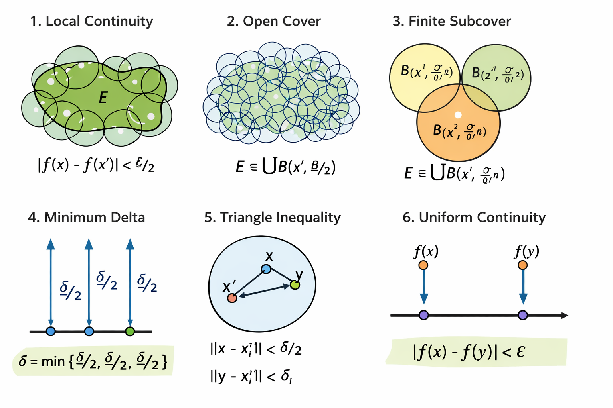
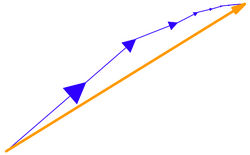

- [Կանտորի թեորեմը (Հավասարաչափ անընդհատություն):](#կանտորի-թեորեմը-հավասարաչափ-անընդհատություն)
- [Կոմպակտ բազմություններ R^n-ում](#կոմպակտ-բազմություններ-rn-ում)
- [Մետրիկական տարածություն](#մետրիկական-տարածություն)
- [Թեորեմ. Կոմպակտի անընդհատ պատկերը](#թեորեմ-կոմպակտի-անընդհատ-պատկերը)

**Սահմանում (Բազմության տրամագիծ):**
$E \subseteq \mathbb{R}^n$ բազմության տրամագիծ (diameter) կոչվում է $\sup_{x', x'' \in E} \|x' - x''\|$ մեծությունը, որը կնշանակենք՝ $\text{diam } E$:

### Կանտորի թեորեմը (Հավասարաչափ անընդհատություն):

Թեորեմ: Եթե $E \subseteq \mathbb{R}^n$ կոմպակտ է և $f: E \to \mathbb{R}^k$ ֆունկցիան անընդհատ է $E$ բազմության վրա, ապա այն հավասարաչափ անընդհատ է այդ բազմության վրա:

**Ապացույցը** (Բորելի լեմմայի օգնությամբ).

Քանի որ $f$-ն անընդհատ է յուրաքանչյուր $x' \in E$ կետում, ապա $\forall \varepsilon > 0$ համար գոյություն ունի $\delta_{x'} > 0$ այնպիսին, որ եթե $\|x - x'\| < \delta_{x'}$, ապա $|f(x) - f(x')| < \varepsilon/2$:

Դիտարկենք $\{B(x', \frac{\delta_{x'}}{2})\}_{x' \in E}$ բաց գնդերի ընտանիքը: Սա հանդիսանում է $E$-ի բաց ծածկույթ:

Ըստ Բորել-Լեբեգի լեմմայի (քանի որ $E$-ն կոմպակտ է), այդ ծածկույթից կարելի է առանձնացնել վերջավոր ենթածածկույթ՝ $B(x_1', \frac{\delta_1}{2}), \dots, B(x_n', \frac{\delta_n}{2})$:

Վերցնենք $\delta = \min \{ \frac{\delta_1}{2}, \dots, \frac{\delta_n}{2} \}$:

Ցույց տանք, որ եթե $\|x - y\| < \delta$, ապա $|f(x) - f(y)| < \varepsilon$:

$x$ կետը պատկանում է որևէ $B(x_i', \frac{\delta_i}{2})$ գնդի:

Այդ դեպքում $\|x - x_i'\| < \frac{\delta_i}{2}$, հետևաբար $|f(x) - f(x_i')| < \varepsilon/2$:

Եռանկյան անհավասարությամբ՝ $\|y - x_i'\| \le \|y - x\| + \|x - x_i'\| < \delta + \frac{\delta_i}{2} \le \frac{\delta_i}{2} + \frac{\delta_i}{2} = \delta_i$:

Քանի որ $\|y - x_i'\| < \delta_i$, ապա $|f(y) - f(x_i')| < \varepsilon/2$:

Վերջապես՝ $|f(x) - f(y)| \le |f(x) - f(x_i')| + |f(x_i') - f(y)| < \frac{\varepsilon}{2} + \frac{\varepsilon}{2} = \varepsilon$:

Թեորեմն ապացուցված է: $f$-ը հավասարաչափ անընդհատ է:

**Հետևանք** :

Եթե $f: E \to \mathbb{R}$ ֆունկցիան անընդհատ է $E$ կոմպակտ բազմության վրա, ապա.

$$\forall \varepsilon > 0, \exists \delta(\varepsilon) > 0 \text{ այնպիսին, որ } \begin{cases} \text{diam } K < \delta \\ K \subseteq E \end{cases} \implies \omega_K(f) < \varepsilon$$

_Բացատրություն:_
$\omega_K(f)$-ը ֆունկցիայի տատանումն է $K$ բազմության վրա (oscillation), որը սահմանվում է որպես ֆունկցիայի արժեքների վերին և ստորին եզրերի տարբերություն այդ բազմության վրա:

Այս հետևանքը փաստում է, որ եթե բազմությունը կոմպակտ է, ապա բավականաչափ փոքր տրամագիծ ունեցող ցանկացած $K$ ենթաբազմության վրա ֆունկցիայի տատանումը կլինի կամայականորեն փոքր:

---

### Կոմպակտ բազմություններ R^n-ում

**Սահմանում:**
$K \subseteq \mathbb{R}^n$ բազմությունը կոչվում է կոմպակտ, եթե կամայական $\{x_n\}_{n=1}^{\infty} \subseteq K$ հաջորդականության համար, երբ $n \to \infty$ և $x_n \to x^*$, ապա $x^* \in K$:

Այս սահմանման հիմնական կետերն են.

Սահմանափակություն: Բազմությունը պետք է լինի սահմանափակ:

Փակություն: Հաջորդականության ցանկացած սահմանային կետ պետք է պատկանի հենց այդ բազմությանը:

Կոմպակտության դերը անընդհատության մեջ:

Դիցուք $E \subseteq \mathbb{R}^m$ բազմությունը կոմպակտ է, և $f: E \to \mathbb{R}^k$ ֆունկցիան անընդհատ է $E$ բազմության վրա: Այդ դեպքում $f(E)$ պատկերների բազմությունը նույնպես կոմպակտ է $\mathbb{R}^k$ տարածության մեջ:

**Մետրիկան (Հեռավորությունը):**

$x$ և $y$ կետերի (հաջորդականությունների) միջև հեռավորությունը սահմանվում է որպես.

$$\rho(x, y) = \sum_{i=1}^{\infty} (x_i - y_i)^2$$

Նշում: Սա սովորական էվկլիդեսյան հեռավորության ընդհանրացումն է անվերջ չափանի դեպքի համար:

Ֆունկցիայի պատկերը (Image)

Կոմպակտության և անընդհատության համատեքստում կարևոր է նաև բազմության պատկերի սահմանումը.

Եթե $U \subseteq E$, ապա $U$ բազմության պատկերը $f$ արտապատկերման տակ սահմանվում է որպես.

$$f(U) := \{ y \in \mathbb{R}^k \mid f(x) = y, \text{ որտեղ } x \in U \}$$

### Մետրիկական տարածություն

**Մետրիկական տարածության սահմանումը**
$M \neq \emptyset$

**Սահմանում.**

$\rho: M \times M \to \mathbb{R}$ արտապատկերումը կոչվում է մետրիկա, եթե բավարարված են հետևյալ պայմանները.

$\rho(x, y) \ge 0; \quad \rho(x, y) = 0 \iff x = y, \quad \forall x, y \in M$

$\rho(x, y) = \rho(y, x), \quad \forall x, y \in M$

$\rho(x, y) \le \rho(x, z) + \rho(z, y), \quad \forall x, y, z \in M$

Եթե $\rho$-ն $M$-ի վրա սահմանված մետրիկա է, ապա $(M, \rho)$ զույգը կանվանենք **մետրիկական տարածություն**:

---

**Հաջորդականությունների տեսակները**

**Զուգամիտություն (Convergence)**
**Սահմանում.** Կասենք, որ $\{x_n\}_{n=1}^{\infty} \subset M$ հաջորդականությունը զուգամիտում է $x^*$-ին $\rho$ մետրիկայի իմաստով, եթե՝

$$\forall \varepsilon > 0 \quad \exists n_0(\varepsilon) \in \mathbb{N} \text{ այնպիսին, որ } \forall n > n_0(\varepsilon) \implies \rho(x_n, x^*) < \varepsilon$$

Նշանակվում է՝ $x_n \xrightarrow{\rho} x^*$:

---

**Ֆունդամենտալ հաջորդականություն (Cauchy Sequence)**
**Սահմանում.** $\{x_n\}_{n=1}^{\infty} \subset M$ հաջորդականությունը կոչվում է ֆունդամենտալ (կամ Կոշիի հաջորդականություն), եթե՝

$$\forall \varepsilon > 0 \quad \exists n_0(\varepsilon) \in \mathbb{N} \text{ այնպիսին, որ } \forall n, m > n_0(\varepsilon) \implies \rho(x_n, x_m) < \varepsilon$$

---

Մետրիկայի օրինակներ

**Դիսկրետ մետրիկա**

Սահմանվում է հետևյալ կերպ.

$$\rho(x, y) = \begin{cases} 0, & \text{եթե } x = y \\ 1, & \text{եթե } x \neq y \text{ (հ.դ.)} \end{cases}$$

**$l^2$ տարածություն** (Hilbert space)

$l^2$-ը բոլոր այն հաջորդականությունների տարածությունն է, որոնց քառակուսիների գումարը վերջավոր է.

$$l^2 := \left\{ x = (x^i)_{i=1}^{\infty} : \sum_{i=1}^{\infty} (x^i)^2 < \infty \right\}$$

Այստեղ $x \in K$ (որտեղ $K$-ն հավանաբար կոմպակտ բազմություն է կամ գունդ):

**Կոորդինատային ներկայացում և անհավասարություններ**

Հաջորդականության տարրերը կոորդինատային տեսքով.

$x_1 = (x_1^1, x_1^2, \dots, x_1^n, \dots)$

$x_2 = (x_2^1, x_2^2, \dots, x_2^n, \dots)$

$x^* = (x_*^1, x_*^2, \dots, x_*^n, \dots)$

Մասնակի գումարների սահմանային անցումը.

Ցանկացած վերջավոր $N$-ի համար տեղի ունի հետևյալ անհավասարությունը, որն օգտագործվում է $l^2$ տարածությունում զուգամիտությունն ապացուցելիս.

$$\sum_{i=1}^{N} (x_n^i)^2 \to \sum_{i=1}^{N} (x_*^i)^2 \le \sum_{i=1}^{\infty} (x_n^i)^2$$

Այս գրառումները սովորաբար օգտագործվում են ապացուցելու համար, որ $l^2$ տարածությունը լրիվ է (այսինքն՝ յուրաքանչյուր ֆունդամենտալ հաջորդականություն ունի սահման այդ նույն տարածության մեջ)։

**Հիլբերտյան տարածության օրինակ ($l^2$)**

Ունենք անվերջ չափանի տարածության օրինակ, որտեղ կետերը հաջորդականություններ են.

Տարածության տարրերը:

$x = (x_1, x_2, x_3, \dots, x_n, \dots)$ հաջորդականությունն է:

Պայմանը ($l^2$ տարածություն):

Որպեսզի տարրը պատկանի այս տարածությանը, պետք է տեղի ունենա հետևյալ գումարի զուգամիտությունը.

$$\sum_{i=1}^{\infty} |x_i|^2 < \infty$$

---

### Թեորեմ. Կոմպակտի անընդհատ պատկերը

Եթե $E \subset \mathbb{R}^n$ բազմությունը կոմպակտ է, և $f: E \to \mathbb{R}^k$ ֆունկցիան անընդհատ է $E$ բազմության վրա ($f \in C(E)$), ապա նրա արժեքների բազմությունը՝ $f(E) \subset \mathbb{R}^k$, նույնպես կոմպակտ է:

**Ապացույցը Բորելի լեմմայով՝ օգտագործելով բաց ծածկույթների գաղափարը.**

$E \subset \mathbb{R}^n$ կոմպակտ է, ինչը նշանակում է՝ $E$-ի ցանկացած բաց ծածկույթից կարելի է առանձնացնել վերջավոր ենթածածկույթ։

$f: E \to \mathbb{R}^k$ անընդհատ է։ Անընդհատության սահմանումն այստեղ հետևյալն է՝ կամայական $V \subset \mathbb{R}^k$ բաց բազմության նախապատկերը ($f^{-1}(V)$) բաց է $E$-ում։

**Վերցնենք պատկերի կամայական բաց ծածկույթ**
Դիցուք $\{V_\alpha\}_{\alpha \in I}$-ն $f(E)$ բազմության կամայական բաց ծածկույթ է $\mathbb{R}^k$-ում։ Սա նշանակում է.

$$f(E) \subset \bigcup_{\alpha \in I} V_\alpha$$

**Անցնենք նախապատկերներին**

Քանի որ $f$-ը անընդհատ է, յուրաքանչյուր $V_\alpha$ բաց բազմության համար նրա նախապատկերը՝ $U_\alpha = f^{-1}(V_\alpha)$, բաց է $E$-ում։

Քանի որ $V_\alpha$-ները ծածկում են $f(E)$-ն, ապա դրանց նախապատկերները՝ $U_\alpha$-ները, պետք է ծածկեն $E$ բազմությունը.

$$E \subset \bigcup_{\alpha \in I} U_\alpha$$

**Կիրառենք Բորելի լեմման (Կոմպակտության հատկությունը)**

Քանի որ $E$-ն կոմպակտ է, նրա $\{U_\alpha\}$ բաց ծածկույթից կարելի է առանձնացնել վերջավոր քանակով բազմություններ՝ $U_{\alpha_1}, U_{\alpha_2}, \dots, U_{\alpha_m}$, որոնք դեռևս ծածկում են $E$-ն.

$$E \subset U_{\alpha_1} \cup U_{\alpha_2} \cup \dots \cup U_{\alpha_m}$$

**Վերադարձ դեպի պատկերների տարածություն**

Եթե այս վերջավոր քանակի $U_{\alpha_i}$ բազմությունների վրա կիրառենք $f$ ֆունկցիան, կստանանք.

$$f(E) \subset f(U_{\alpha_1} \cup \dots \cup U_{\alpha_m}) = f(U_{\alpha_1}) \cup \dots \cup f(U_{\alpha_m})$$

Քանի որ $f(U_{\alpha_i}) = f(f^{-1}(V_{\alpha_i})) \subset V_{\alpha_i}$, ապա.

$$f(E) \subset V_{\alpha_1} \cup V_{\alpha_2} \cup \dots \cup V_{\alpha_m}$$

Մենք ցույց տվեցինք, որ $f(E)$ բազմության կամայական բաց ծածկույթից հնարավոր եղավ առանձնացնել վերջավոր ենթածածկույթ։ Հետևաբար, ըստ Բորելի սկզբունքի, $f(E)$-ն կոմպակտ է։

Ինչո՞ւ է սա ավելի ուժեղ ապացույց

Այս եղանակը կախված չէ հաջորդականություններից և աշխատում է ցանկացած տոպոլոգիական տարածությունում, ոչ միայն $\mathbb{R}^n$-ում։ Ձեր նկարներում տեսած դիսկրետ մետրիկայի դեպքում, օրինակ, ցանկացած վերջավոր բազմություն կոմպակտ է հենց այս պատճառով՝ ցանկացած ծածկույթից կարելի է պարզապես վերցնել այն բաց բազմությունները, որոնք պարունակում են այդ վերջավոր կետերը։

