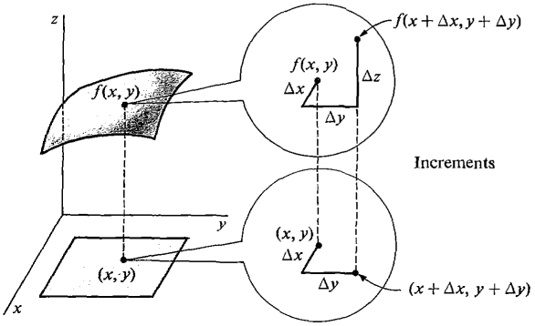

13.02.26
- [Ֆունկցիայի մասնակի աճ և մասնակի ածանցյալ](#ֆունկցիայի-մասնակի-աճ-և-մասնակի-ածանցյալ)
  - [Ընդհանուր դեպք ($m$ փոփոխականի համար)](#ընդհանուր-դեպք-m-փոփոխականի-համար)

## Ֆունկցիայի մասնակի աճ և մասնակի ածանցյալ

Դիցուք տրված է $f: D \to \mathbb{R}$, որտեղ $D \subseteq \mathbb{R}^2$-ը բաց ենթաբազմություն է։

**Սահմանում**: $f$ ֆունկցիայի **մասնակի աճ** ըստ $x$-ի (ըստ $y$-ի) $(x_0, y_0) \in D$ կետում կոչվում է հետևյալ արտահայտությունը.

$$f(x_0 + \Delta x, y_0) - f(x_0, y_0) \quad \left( f(x_0, y_0 + \Delta y) - f(x_0, y_0) \right)$$

և նշանակվում է $\Delta f_x$ ($\Delta f_y$)։

$\Delta f_x = f(x_0 + \Delta x, y_0) - f(x_0, y_0)$

$\Delta f_y = f(x_0, y_0 + \Delta y) - f(x_0, y_0)$

**Սահմանում:** $f$-ի **լրիվ աճ** $(x_0, y_0) \in D$ կետում կոչվում է հետևյալ արտահայտությունը.

$$\Delta f = f(x_0 + \Delta x, y_0 + \Delta y) - f(x_0, y_0)$$

**Սահմանում:** $f$-ի **մասնակի ածանցյալ** ըստ $x$-ի $(x_0, y_0)$ կետում կոչվում է հետևյալ սահմանը (վերջավոր կամ անվերջ).

$$\lim_{\Delta x \to 0} \frac{f(x_0 + \Delta x, y_0) - f(x_0, y_0)}{\Delta x} \equiv \frac{\partial f}{\partial x}(x_0, y_0)$$

կամ $f'_x(x_0, y_0)$։

**Սահմանում:** $f$-ի մասնակի ածանցյալ ըստ $y$-ի $(x_0, y_0)$ կետում կոչվում է.

$$\lim_{\Delta y \to 0} \frac{f(x_0, y_0 + \Delta y) - f(x_0, y_0)}{\Delta y} := \frac{\partial f}{\partial y}(x_0, y_0)$$

կամ $f'_y(x_0, y_0)$։

Այլ նշանակումներ:

$\frac{\partial f}{\partial x} = \lim_{\Delta x \to 0} \frac{\Delta f_x}{\Delta x}$

$\frac{\partial f}{\partial y} = \lim_{\Delta y \to 0} \frac{\Delta f_y}{\Delta y}$

---

**Թեորեմ**: Եթե $\exists f'_x, f'_y$-ը $(x_0, y_0) \in D$ կետում և մասնակի ածանցյալները անընդհատ են $(x_0, y_0)$-ի որոշ շրջակայքում, ապա ֆունկցիայի աճը կարող ենք ներկայացնել հետևյալ կերպ.

$$\Delta f = f'_x(x_0, y_0)\Delta x + f'_y(x_0, y_0)\Delta y + o(\sqrt{\Delta x^2 + \Delta y^2})$$

**Ապացույց**:

$\Delta f = f(x_0 + \Delta x, y_0 + \Delta y) - f(x_0, y_0) =$

$\left[ f(x_0 + \Delta x, y_0 + \Delta y) - f(x_0 + \Delta x, y_0) \right] + \left[ f(x_0 + \Delta x, y_0) - f(x_0, y_0) \right] = (*)$

Կիրառելով Լագրանժի թեորեմը (միջին արժեքի թեորեմ).

$\left[ f(x_0 + \Delta x, y_0 + \Delta y) - f(x_0 + \Delta x, y_0) \right]$ = $f'_y(x_0 + \Delta x, \bar{y}) \Delta y \quad (**)$, որտեղ $y_0 < \bar{y} < y_0 + \Delta y$

$\left[ f(x_0 + \Delta x, y_0) - f(x_0, y_0) \right] = f'_x(\bar{x}, y_0) \Delta x \quad (***)$, որտեղ $x_0 < \bar{x} < x_0 + \Delta x$

Դիտարկենք արտահայտությունը. պետք է ցույց տանք, որ

$$\lim_{\substack{\Delta x \to 0 \\ \Delta y \to 0}} \frac{\Delta f - f'_x(x_0, y_0)\Delta x - f'_y(x_0, y_0)\Delta y}{\sqrt{\Delta x^2 + \Delta y^2}} = 0$$

$$\left| \frac{\Delta f - f'_x(x_0, y_0)\Delta x - f'_y(x_0, y_0)\Delta y}{\sqrt{\Delta x^2 + \Delta y^2}} \right| =$$
$$= \left| \frac{f'_y(x_0 + \Delta x, \bar{y})\Delta y + f'_x(\bar{x}, y_0)\Delta x - f'_x(x_0, y_0)\Delta x - f'_y(x_0, y_0)\Delta y}{\sqrt{\Delta x^2 + \Delta y^2}} \right| =$$

$$= \left| \frac{(f'_y(x_0 + \Delta x, \bar{y}) - f'_y(x_0, y_0))\Delta y + (f'_x(\bar{x}, y_0) - f'_x(x_0, y_0))\Delta x}{\sqrt{\Delta x^2 + \Delta y^2}} \right| \le$$

$$\le \frac{|f'_y(x_0 + \Delta x, \bar{y}) - f'_y(x_0, y_0)| |\Delta y|}{\sqrt{\Delta x^2 + \Delta y^2}} + \frac{|f'_x(\bar{x}, y_0) - f'_x(x_0, y_0)| |\Delta x|}{\sqrt{\Delta x^2 + \Delta y^2}}\le$$

$$\le 1 \cdot |f'_y(x_0 + \Delta x, \bar{y}) - f'_y(x_0, y_0)| + 1 \cdot |f'_x(\bar{x}, y_0) - f'_x(x_0, y_0)|$$

Քանի որ $\Delta x \to 0, \Delta y \to 0 \implies$ սահմանը դառնում է $0$ (ածանցյալների անընդհատության պատճառով)։

### Ընդհանուր դեպք ($m$ փոփոխականի համար)
Դիցուք ունենք $f: D \to \mathbb{R}$, որտեղ $D \subseteq \mathbb{R}^m$ բաց տիրույթ է, $x_0 \in D \Rightarrow x_0 = (x_0^1, x_0^2, \dots, x_0^m)$։

**Սահմանում:** $f$-ի **մասնակի աճ** ըստ $i$-րդ կոորդինատի $x_0 \in D$ կետում.

$\Delta f_{x_0^i} = f(x_0^1, x_0^2, \dots, x_0^i + \Delta x_i, \dots, x_0^m) - f(x_0^1, \dots, x_0^i, \dots, x_0^m)$

**Սահմանում:** $f$-ի **լրիվ աճ** $x_0 \in D$ կետում.

$\Delta f = f(x_0^1 + \Delta x_1, x_0^2 + \Delta x_2, \dots, x_0^m + \Delta x_m) - f(x_0^1, \dots, x_0^m)$

**Սահմանում:** $f$-ի **մասնակի ածանցյալ** $x_0 \in D$ ըստ $x_i$ կոորդինատի.

$\lim_{\Delta x_i \to 0} \frac{\Delta f_{x_0^i}}{\Delta x_i}$

---

**Օրինակներ:**

$f(x, y) = \sin(xy)$

$f'_x = y \cos(xy)$

$f'_y = x \cos(xy)$

$f''_{xy} = -yx \sin(xy) + \cos(xy)$

$f''_{yx} = -xy \sin(xy) + \cos(xy)$

$$
f(x, y) = \begin{cases} 1, & xy=0 \\ 0, & xy \neq 0 \end{cases}
$$

$$
f'_x(0,0) = \lim_{\Delta x \to 0} \frac{f(0 + \Delta x, 0) - f(0, 0)}{\Delta x} = \frac{1-1}{\Delta x} = 0
$$

$$
f'_y(0,0) = \lim_{\Delta y \to 0} \frac{f(0, 0 + \Delta y) - f(0, 0)}{\Delta y} = 0
$$
$\lim_{(x,y) \to (0,0)} f(x, y) \neq f(0, 0)$, քանի որ $\lim_{x \to 0} f(x, x) = 0$, իսկ $f(0, 0) = 1$:

Այսինքն, շատ փոփոխականների ֆունկցիաների դեպքում, նույնիսկ եթե բոլոր մասնակի ածանցյալները գոյություն ունեն, չենք կարող ասել, որ ֆունկցիան անընդհատ է։ Մինչդեռ մի փոփոխականի ֆունկցիայի համար կարող էինք։

---

**Սահմանում:** $f: D \to \mathbb{R}$ ($D \subseteq \mathbb{R}^2$) ֆունկցիան կոչվում է **դիֆերենցելի** $(x_0, y_0) \in D$ կետում, եթե այդ կետում ֆունկցիայի աճը կարելի է ներկայացնել այս կերպ.

$$\Delta f = A\Delta x + B\Delta y + o(\sqrt{\Delta x^2 + \Delta y^2})$$

որտեղ $A, B \in \mathbb{R}$։

Շատ փոփոխականի ֆունկցիաների դեպքում հակառակ պնդումը ճիշտ չէ՝ կարող ենք ներկայացնել այս տեսքով => մասնակի ածանցյալները գոյություն ունեն (A-ն x-ի մասնակի ած․, B-ն y-ի), _բայց պարտադիր չէ, որ լինեն անընդհատ_։

