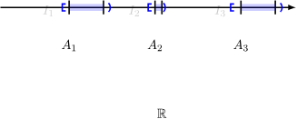

# Հավանականությունների տեսության հիմնական հասկացությունները
- [Հավանականությունների տեսության հիմնական հասկացությունները](#հավանականությունների-տեսության-հիմնական-հասկացությունները)
  - [Դասական սահմանում](#դասական-սահմանում)
  - [Պատահույթների տեսակները և հարաբերությունները](#պատահույթների-տեսակները-և-հարաբերությունները)
  - [Հավանականությունների գումարման թեորեմը](#հավանականությունների-գումարման-թեորեմը)
  - [Պայմանական հավանականություն և բազմապատկման թեորեմ](#պայմանական-հավանականություն-և-բազմապատկման-թեորեմ)
  - [Բայեսի բանաձև](#բայեսի-բանաձև)
  - [Աքսիոմատիկ հիմունքներ (Չափի տեսություն)](#աքսիոմատիկ-հիմունքներ-չափի-տեսություն)
    - [1. Չափի գաղափարը և կետերի «ծածկումը»](#1-չափի-գաղափարը-և-կետերի-ծածկումը)
    - [2. Համարժեքության հարաբերություն և ֆակտոր բազմություն](#2-համարժեքության-հարաբերություն-և-ֆակտոր-բազմություն)
    - [3. $E$ բազմության կառուցումը (Վիտալիի բազմություն)](#3-e-բազմության-կառուցումը-վիտալիի-բազմություն)
    - [4. Ինչո՞ւ $E$-ն չափելի չէ](#4-ինչու-e-ն-չափելի-չէ)
    - [Եզրակացություն հավանականության մասին](#եզրակացություն-հավանականության-մասին)

## Դասական սահմանում

Հավանականությունների տեսության **դասական սահմանումը** հիմնված է հավասարահնարավոր ելքերի վրա:

**Սահմանում.** $A$ պատահույթի հավանականություն կոչվում է տվյալ փորձի ընթացքում $A$ պատահույթին նպաստող ելքերի քանակի ($m$) հարաբերությունը բոլոր հնարավոր ելքերի քանակին ($n$):

$$P(A) = \frac{m}{n}$$

**Օրինակ.** Նետում ենք զառը: Գտնել հավանականությունը, որ բացված կետերի քանակը մեծ է 4-ից: A = {բացված կետերի քանակը մեծ է 4-ից}

- Հնարավոր ելքեր՝ $n = 6$ $\{1, 2, 3, 4, 5, 6\}$:
    
- Նպաստող ելքեր ($A = \{5, 6\}$)՝ $m = 2$:
    
- $P(A) = \frac{2}{6} = \frac{1}{3}$:
    

---

## Պատահույթների տեսակները և հարաբերությունները

- **Հավաստի պատահույթ.** Պատահույթը կոչվում է հավաստի ($\Omega$), եթե այն անհրաժեշտաբար հանդես է գալիս կատարվող փորձում: $P(\Omega) = 1$:
	*Օրինակ՝ ունենք արկղ, որտեղ կան սև և սպիտակ գնդիկներ։ Հավանականությունը, որ արկղից հանած գնդիկը սև է կամ սպիտակ 100% է։*
	    
- **Անհնար պատահույթ.** Պատահույթը կոչվում է անհնար ($\emptyset$), եթե նրա հանդես գալը բացառված է տվյալ փորձում: $P(\emptyset) = 0$:
    
- **Անհամատեղելի պատահույթներ.** Երկու պատահույթներ կոչվում են անհամատեղելի, եթե դրանցից մեկի հանդես գալը բացառում է մյուսի հանդես գալը: $P(A \cap B) = 0$:
	*Արկղի օրինակում, եթե դիտարկենք հավանականություն, որ հանած գնդիկը սև է և մեկ այլ հավանականություն, որ սպիտակ է, ապա այդ երկուսը իրար հետ տեղի ունենալ չեն կարող, հանած գնդիկը չի կարող միաժամանակ սև և սպիտակ լինել։* 
    
- **Մասնավոր դեպք.** $B$ պատահույթը կոչվում է $A$-ի մասնավոր դեպք ($B \subset A$), եթե $B$-ի հանդես գալուց հանդես է գալիս նաև $A$-ն:
	*Օրինակ՝ B = {$\le 4$}, A = {$\le 3$}:*
    
- **Լրիվ խումբ.** Մի քանի պատահույթներ կազմում են լրիվ խումբ, եթե փորձի ընթացքում անհրաժեշտաբար հանդես կգա դրանցից մեկը:
*Պատկերացրու զառի նետումը: Զառն ունի 6 նիստ:
Պատահույթներ. A1​ (բացվում է 1), A2​ (բացվում է 2), A3​ (3), A4​ (4), A5​ (5), A6​ (6):
Ինչո՞ւ է լրիվ խումբ. Որովհետև նետելիս անհրաժեշտաբար այս 6 թվերից մեկը կբացվի: Չի կարող լինել այնպիսի դեպք, որ զառը նետես ու այս թվերից ոչ մեկը չհայտնվի:*
    
- **Հակադիր պատահույթներ.** Երկու պատահույթներ կոչվում են հակադիր ($A$ և $\bar{A}$), եթե դրանք անհամատեղելի են և կազմում են լրիվ խումբ:
*Օրինակ: Քննության հանձնում
Պատահույթ A. Ուսանողը հանձնեց քննությունը:
Պատահույթ Aˉ. Ուսանողը չհանձնեց քննությունը:
Ինչո՞ւ են հակադիր. Դրանք անհամատեղելի են (չես կարող միաժամանակ և՛ հանձնել, և՛ չհանձնել) և կազմում են լրիվ խումբ (այլ տարբերակ չկա՝ կա՛մ հանձնում ես, կա՛մ ոչ):*
  
- **Կախյալ պատահույթներ․** A և B պատահույթները կոչվում են կախյալ, եթե դրանցից մեկի հանդես գալը ազդում է մյուսի հանդես գալու հավանականության վրա։

- **Տարրական (էլեմենտար) ելք․** Պատահույթի այն ելքերը, որոնք չունեն մասնավոր դեպք, կոչվում են տարրական (էլեմենտար) ելքեր։ Էլեմենտար ելքերի բազմությունը նշանակվում է $\Omega$.

Վերը նշված սահմանումներից հետևում է, որ 
$P(\Omega) = 1$, $P(\emptyset) = 1$
$0 \leq P(A) \leq 1$

Համատեղելի պատահույթների հատումը դատարկ չէ։ Անհամատեղելիներինը՝ դատարկ է։

Անհամատեղելի պատահույթների գումարման բանաձևի արտածումը դասական սահմանման միջոցով։
$$P(A \cup B) = P(A) + P(B)$$
- $k$ - բոլոր հնարավոր ելքերի քանակը
    
- $A$-ին նպաստող ելքերի քանակը՝ $l_1$
    
- $B$-ին նպաստող ելքերի քանակը՝ $l_2$

$$P(A) = \frac{l_1}{k}$$

$$P(B) = \frac{l_2}{k}$$

**Ապացույց:**
$$P(A \cup B) = \frac{l_1 + l_2}{k} = \frac{l_1}{k} + \frac{l_2}{k} = P(A) + P(B)$$

---
$A$ պատահույթի և նրա լրացման (հակադիր պատահույթի՝ $\bar{A}$) հատկությունները $\Omega$ (օմեգա) տիրույթում։

**Պայման:**
$A \subseteq \Omega$
$\bar{A}$ (հակադիր պատահույթ)

**Հատկություններ:**

1. **Հատում:** $A \cap \bar{A} = \emptyset \implies P(A \cap \bar{A}) = 0$
    
    _(Պատահույթը և նրա հակադիրը միաժամանակ տեղի ունենալ չեն կարող)_
    
2. **Միավորում:** $A \cup \bar{A} = \Omega \implies P(A \cup \bar{A}) = P(\Omega) = 1$
    
    _(Պատահույթներից գոնե մեկը միշտ տեղի է ունենում)_
    

---

## Հավանականությունների գումարման թեորեմը

**Անհամատեղելի պատահույթների համար.**

Եթե $A$ և $B$ պատահույթները անհամատեղելի են, ապա դրանցից որևէ մեկի հանդես գալու հավանականությունը հավասար է դրանց հավանականությունների գումարին:

$$P(A \cup B) = P(A) + P(B)$$

**Ընդհանուր դեպք (Կամայական պատահույթների համար).**

Երկու պատահույթների գումարի հավանականությունը հավասար է նրանց հավանականությունների գումարին՝ առանց նրանց համատեղ հանդես գալու հավանականության:

$$P(A \cup B) = P(A) + P(B) - P(A \cap B)$$

$n$ - բոլոր հնարավոր ելքերի քանակը։
$l_1$ - $A$-ին նպաստող ելքերի քանակը։
$l_2$ - $B$-ին նպաստող ելքերի քանակը։
$k$ - և՛ $A$-ին, և՛ $B$-ին միաժամանակ նպաստող ելքերի քանակը ($A \cap B$)։

$$P(A) = \frac{l_1}{n}, \quad P(B) = \frac{l_2}{n}, \quad P(A \cap B) = \frac{k}{n}$$

$$P(A \cup B) = \frac{l_1 + l_2 - k}{n} = \frac{l_1}{n} + \frac{l_2}{n} - \frac{k}{n}$$
$$P(A \cup B) = P(A) + P(B) - P(A \cap B)$$

---
## Պայմանական հավանականություն և բազմապատկման թեորեմ

**Պայմանական հավանականություն.**

$A$ պատահույթի հավանականությունը, հաշվարկված այն պայմանով, որ $B$ պատահույթն արդեն տեղի է ունեցել, կոչվում է պայմանական հավանականություն:

$$P(A/B) = \frac{P(A \cap B)}{P(B)}$$

**Բազմապատկման թեորեմ.**

Երկու պատահույթների համատեղ հանդես գալու հավանականությունը հավասար է դրանցից մեկի հավանականության և մյուսի պայմանական հավանականության արտադրյալին:

$$P(A \cap B) = P(B) \cdot P(A/B) = P(A) \cdot P(B/A)$$

**Անկախ պատահույթներ.**

$A$ և $B$ պատահույթները կոչվում են անկախ, եթե մեկի հանդես գալը չի փոխում մյուսի հանդես գալու հավանականությունը: Այդ դեպքում.

$$P(A \cap B) = P(A) \cdot P(B)$$

## Բայեսի բանաձև
$$P(A / B) = \frac{P(A) \cdot P(B / A)}{P(B)}$$

Անկախ պատահույթների դեպքում։ $P(A \cap B) = P(A) \cdot P(B)$

---
## Աքսիոմատիկ հիմունքներ (Չափի տեսություն)

### 1. Չափի գաղափարը և կետերի «ծածկումը»

Պատկերված է, թե ինչպես են փորձում հաշվարկելի բազմության կետերը ծածկել շատ փոքր միջակայքերով։

- **Էպսիլոնից փոքր չափ.** Եթե ունենք $\{1, 2, 3, \dots, n, \dots\}$ հաշվարկելի բազմություն, յուրաքանչյուր $n$-րդ կետը կարող ենք ծածկել $\frac{\varepsilon}{2^{n+1}}$ երկարություն ունեցող միջակայքով։
    
- **Գումարային չափ.** Այդ բոլոր միջակայքերի երկարությունների գումարը կլինի.
    
    $$\sum_{n=1}^{\infty} \frac{\varepsilon}{2^{n+1}} < \varepsilon$$
    
    Սա ապացուցում է, որ հաշվարկելի բազմության չափը $0$ է, քանի որ $\varepsilon$-ը կարող է լինել կամայական փոքր թիվ։
    

### 2. Համարժեքության հարաբերություն և ֆակտոր բազմություն

$[0, 1]$ հատվածի վրա սահմանվում է **համարժեքության հարաբերություն** ($\sim$)։

- **Սահմանում.** $x \sim y$, եթե նրանց տարբերությունը ռացիոնալ թիվ է՝ $x - y \in \mathbb{Q}$։
    
- **Հատկություններ.** Այս հարաբերությունը ռեֆլեքսիվ է ($x \sim x$, քանի որ $0 \in \mathbb{Q}$), սիմետրիկ է ($x \sim y \implies y \sim x$) և տրանզիտիվ։
    
- Այն տրոհում է $[0, 1]$ հատվածը համարժեքության դասերի՝ $[x], [y], \dots$, որոնցից յուրաքանչյուրը պարունակում է իրարից ռացիոնալ թվով տարբերվող տարրեր։
    

### 3. $E$ բազմության կառուցումը (Վիտալիի բազմություն)

$E$ բազմությունը կառուցվում է՝ յուրաքանչյուր համարժեքության դասից ընտրելով ճիշտ մեկական տարր։

- **Ի՞նչ է $E$-ն.** Այն կոնտինուում հզորության բազմություն է, քանի որ համարժեքության դասերի քանակը կոնտինուում է։
    
- **$E_n$ շեղումներ.** Վերցվում են բոլոր $t_n \in [-1, 1] \cap \mathbb{Q}$ ռացիոնալ թվերը և ստեղծվում են $E$ բազմության շեղված տարբերակները՝ $E_n = t_n + E$։
    
- **Չհատվողություն.** Ապացուցվում է, որ եթե $n \neq m$, ապա $E_n \cap E_m = \emptyset$ (դրանք չունեն ընդհանուր տարրեր)։
    

### 4. Ինչո՞ւ $E$-ն չափելի չէ

Դիտարկվում է բոլոր $E_i$ բազմությունների միավորումը.

- Այդ միավորումը պարունակում է $[0, 1]$ հատվածը և զետեղված է $[-1, 2]$ հատվածի մեջ։
    
- Եթե $E$-ն լիներ չափելի և ունենար $m(E)$ չափ, ապա ըստ չափի ադիտիվության հատկության՝
    
    $$m([0, 1]) \leq \sum_{i=1}^{\infty} m(E_i) \leq m([-1, 2])$$
    
    $$1 \leq \sum_{i=1}^{\infty} m(E) \leq 3$$
    
- **Հակասություն.** Եթե $m(E) = 0$, ապա անվերջ գումարը կլինի $0$, ինչը հակասում է $1 \leq 0$ պայմանին։ Եթե $m(E) > 0$, ապա անվերջ գումարը կլինի $\infty$, ինչը հակասում է $\infty \leq 3$ պայմանին։
    
[click and watch this!!!](https://youtu.be/hs3eDa3_DzU?si=vP_F8auUZv86hVCA)

### Եզրակացություն հավանականության մասին

Քանի որ **$E$ բազմությունը չափելի չէ**, մենք չենք կարող նրան վերագրել հավանականություն։

> **Հետևաբար**, եթե դուք կետը նետում եք $[0, 1]$ հատվածի վրա, դուք իրավունք չունեք հարցնելու. «Որքա՞ն է հավանականությունը, որ կետը կընկնի $E$-ի մեջ»։ Այդ հարցը մաթեմատիկորեն անիմաստ է, քանի որ $E$-ն չունի «երկարություն» կամ «չափ»։